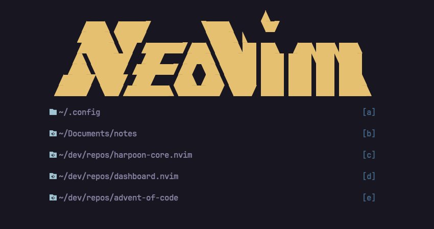

# Introduction

Neovim dashboard plugin



- Look at the [Options -> header](#header) section to get results like above

# Features

- Fully customizable header with reference for integrating with ascii art plugin
- Provide directories and this plugin will:
  - Display them on the dashboard
  - Make them accessible with single letter hotkey
- Input is ordered and hotkeys are generated sequentially, making for a consistent experience

# Install

The setups below show the default values, which if supplied will result in an empty screen.

It is recommended to provide `directories` at least, and a `header` for some fun.

## Lazy.nvim

```lua
{
    'MeanderingProgrammer/dashboard.nvim',
    event = 'VimEnter',
    config = function()
        require('dashboard').setup({
            -- Dashboard header
            header = {},
            -- Format to display date in
            date_format = nil,
            -- List of directory paths
            directories = {},
            -- Sections to add at bottom, these can be string references to 
            -- functions in sections.lua, custom strings, or custom functions
            footer = {},
            -- Highlight groups to use for various components
            highlight_groups = {
                header = 'Constant',
                icon = 'Type',
                directory = 'Delimiter',
                hotkey = 'Statement',
            },
        })
    end,
}
```

# Options

## `header`

By default no header is provided by the plugin. As it is just an array of strings you can create
your own or use another plugin which provides the ascii art.

For example using [MaximilianLloyd/ascii.nvim](https://github.com/MaximilianLloyd/ascii.nvim) in
`Lazy.nvim` to achieve the look in the screenshots:

```lua
{
    'MeanderingProgrammer/dashboard.nvim',
    event = 'VimEnter',
    dependencies = {
        { 'MaximilianLloyd/ascii.nvim', dependencies = { 'MunifTanjim/nui.nvim' } },
    },
    config = function()
        require('dashboard').setup({
            header = require('ascii').art.text.neovim.sharp,
            directories = {
                '~/.config',
                '~/Documents/notes',
                '~/dev/repos/harpoon-core.nvim',
                '~/dev/repos/dashboard.nvim',
                '~/dev/repos/advent-of-code',
            },
        })
    end,
}
```

Using this exact setup will result in the same Dashboard as the screenshot at the top, assuming these
are valid directories on your system.

You can also use methods provided by the ascii plugin to randomize the look on every load, for example:

```lua
require('ascii').get_random_global()
```

## `date_format`

This will add the date right after the header in the format specified.

The date is static and will not be updated until the dashboard is reloaded.

This will build off of the `header` option so the difference in screenshots is more clear.

```lua
{
    'MeanderingProgrammer/dashboard.nvim',
    event = 'VimEnter',
    dependencies = {
        { 'MaximilianLloyd/ascii.nvim', dependencies = { 'MunifTanjim/nui.nvim' } },
    },
    config = function()
        require('dashboard').setup({
            header = require('ascii').art.text.neovim.sharp,
            date_format = '%Y-%m-%d %H:%M:%S',
            directories = {
                '~/.config',
                '~/Documents/notes',
                '~/dev/repos/harpoon-core.nvim',
                '~/dev/repos/dashboard.nvim',
                '~/dev/repos/advent-of-code',
            },
        })
    end,
}
```


## `footer`

Resolving each value in the footer sections happens as follows:

- If the value is a string:
  - If `sections.lua` has a function with that name call that function and get the result. 
    Valid values for this are `version` and `startuptime`.
  - Otherwise use the string value as it was provided.
- If the value is a function:
  - Call the function, get the result, and check that it is a string.
- Otherwise print an error message

# Acknowledgements

The popular [dashboard-nvim](https://github.com/nvimdev/dashboard-nvim) plugin was used as a reference
point in the development of this plugin. These plugins do very different things other than sharing the
concept of being a dashboard. In many ways `dashboard-nvim` is better and has a lot of neat features
but I was looking for something more user defined as opposed to inferred.

# Style Check

```
stylua --check -g '*.lua' -- .
```

# TODO

- Look into autogroups, figure out if there's a nice way to avoid stacking calls
- Decide on desired behavior when hotkey is pressed while multiple windows are open
- Integrate directory list with some existing bookmark plugins
